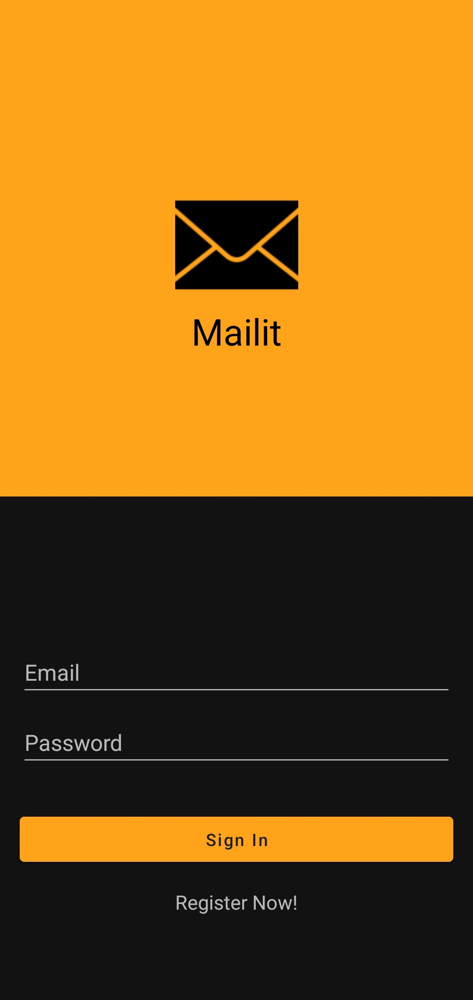
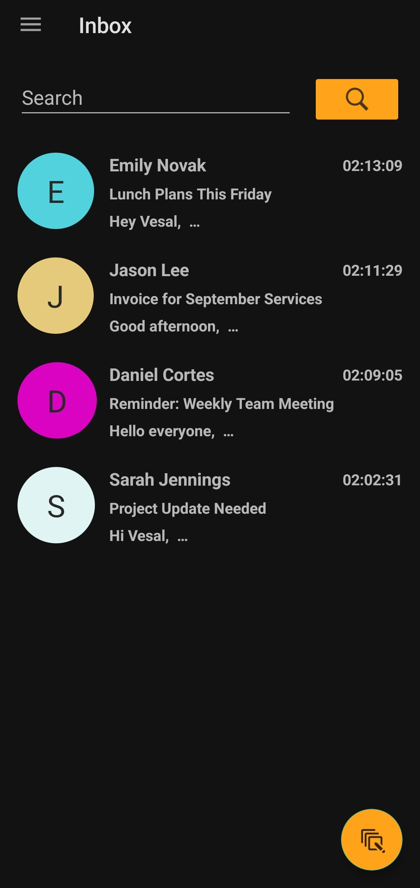
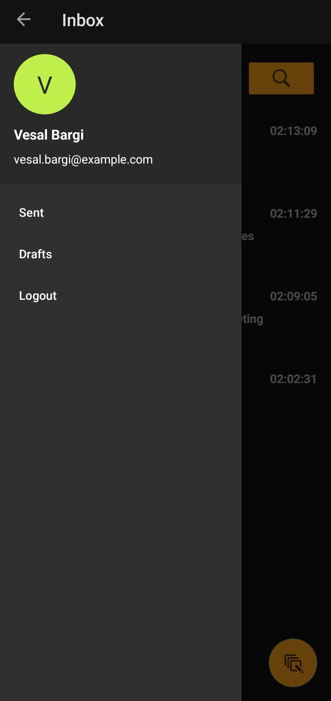
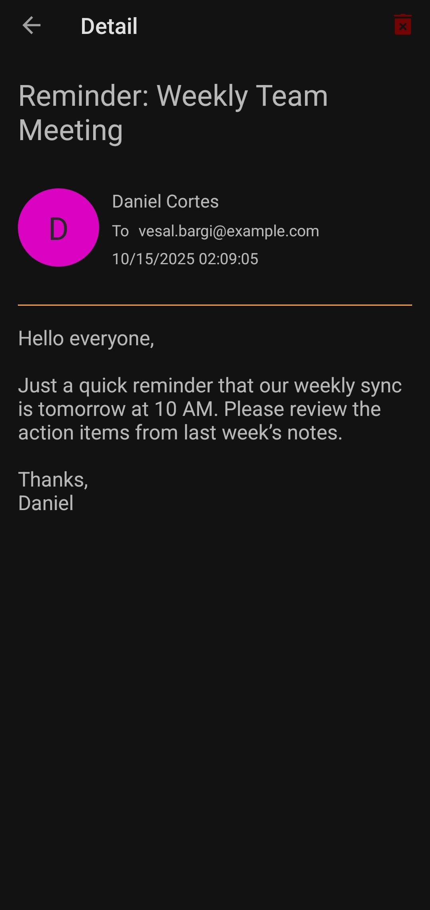

# Mailit Android Project

Mailit is an Android email client app developed in Java to help users send, receive, and manage their emails efficiently. It supports user sign-up and sign-in with server authentication, offline caching using a local database, and seamless synchronization with a remote server. The app features multiple email lists (Inbox, Sent, Draft), search functionality, swipe-to-refresh, and a navigation drawer for easy access to different sections.

## Features

- **User Authentication**:  
  Secure sign-up and sign-in with server-side verification through REST APIs.  
  Uses Back4App as the backend and stores credentials locally using Room.

- **Email Management**:  
  Supports **Inbox**, **Sent**, and **Draft** lists with full CRUD functionality.  
  Emails include: Sender, Receiver, Subject, Content, Date, and Read Status.

- **Compose & Drafts**:  
  Compose new emails and send them instantly or save drafts to edit later.  
  Unsaved changes trigger a dialog allowing the user to discard or save as draft.

- **Synchronization**:  
  Uses Room for local caching and Volley for network communication.  
  Automatically syncs with the server on refresh or first open of lists.

- **Inbox & Sent Lists**:  
  Displays unread emails in bold. Emails are sorted by date (newest first).  
  Swipe-to-refresh fetches latest data and updates the local database.

- **Search Functionality**:  
  Performs searches across multiple fields (except date) in Inbox, Sent, and Drafts.  
  Differentiates read/unread status in Inbox search results.

- **Delete & Logout**:  
  Emails can be deleted from both server and local database.  
  Logout removes user data from local storage and navigates back to sign-in.

- **Profile Image Handling**:  
  Displays either a profile image (via URL) using Picasso or a random colored placeholder with user’s initial.

- **Navigation Drawer**:  
  Seamless navigation between Inbox, Sent, Drafts, and Search screens.  
  Floating Action Button (FAB) for quick compose access.

- **Swipe to Delete**:  
  Lets users remove emails easily from the Inbox, Sent, and Draft lists with a quick swipe for faster email management.

## Technologies Used

- **Language**: Java  
- **IDE**: Android Studio  
- **Database**: Room Persistence Library  
- **Networking**: Volley  
- **Image Loading**: Picasso  
- **Backend Service**: Back4App (REST API)  
- **UI Components**: RecyclerView, DrawerLayout, SwipeRefreshLayout, AsyncTask

## Screenshots

  
  
  
  

## License

This project is licensed under the MIT License.

